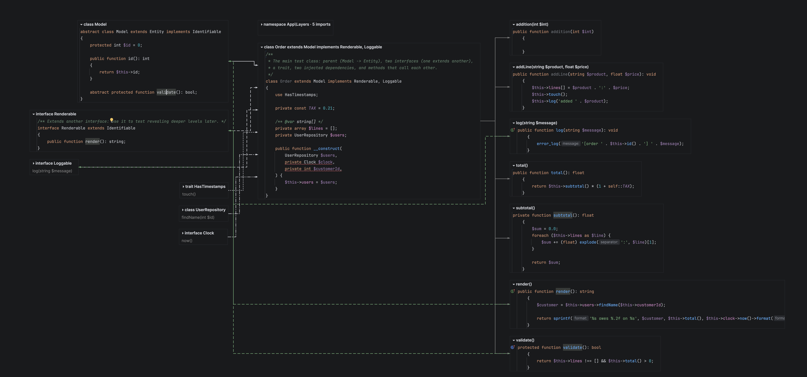
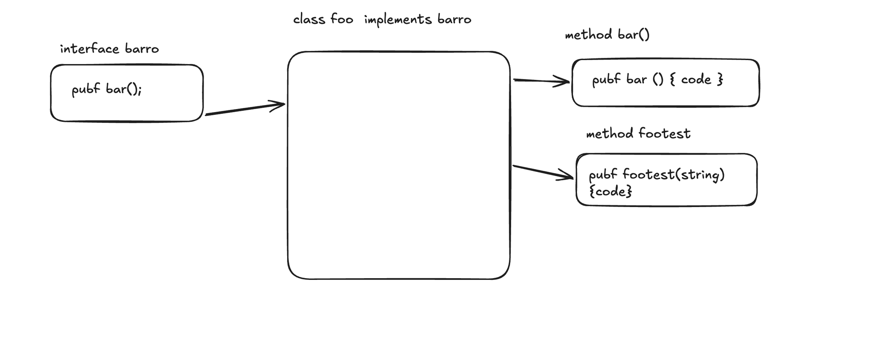
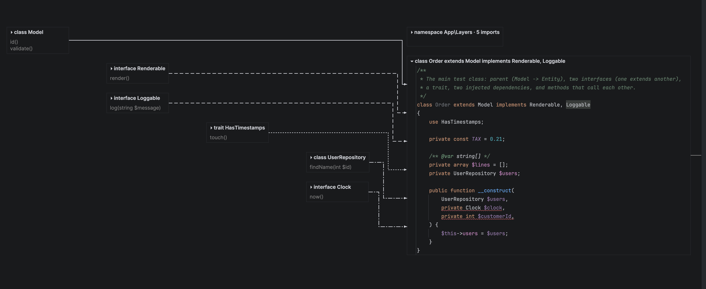

# CodeLanes

**Read code like a human.** CodeLanes is a PhpStorm plugin that replaces the vertical, line-by-line editor
with a canvas of real, editable code blocks laid out in lanes: what a class builds on on the left, the class
in the middle, its methods on the right, connected by colour-coded lines.



## Why

More and more code is written by AI, and more and more of it gets skimmed instead of understood. A long
file read top to bottom hides its structure: which interface does this method satisfy, which methods call
each other, what does this class actually depend on?

CodeLanes cuts a class into digestible blocks and puts the structure on screen, so that the developer
who has to own the code really reads it. It is a **viewer and editor**, not an explainer: no AI, no
summaries, everything comes from the real code.



## What you get

- **The canvas is the editor.** Every block is a real PhpStorm editor showing one slice of the file:
  completion, inspections, refactorings and undo all work. The file on disk stays plain PHP, so git, your
  team and your tools see nothing unusual.
- **Lanes, not a mess.** Parents, interfaces, traits and injected dependencies each get their own lane in a
  staircase left of the class. The class (with a collapsed `namespace`/`use` header above it) sits in the
  middle, and its methods sit in a lane on the right. Methods that call each other are grouped together.
- **Colour-coded lines:** extends, implements, uses trait, injected, has method, calls, overrides. A legend
  in the corner explains them. Call and override lines only show for the block you are working in, so the
  canvas stays calm. Lines go around blocks instead of through them.
- **Who implements this?** Open an interface, trait or abstract class and you also see the classes that
  implement, use or extend it, plus the methods they implement.
- **Drag to arrange.** Your arrangement is remembered per file (just for you, not in git). **Tidy up** puts
  everything back in its lanes.
- **Safe editing.** Typing never ends up inside a hidden block. While the code is half-typed or broken, the
  canvas keeps the last good blocks instead of jumping around.



*Screenshots are from development builds; colours and details may differ slightly in the current version.*

## Install

CodeLanes isn't on the JetBrains Marketplace yet, so for now you build it from source.

Requirements: **PhpStorm 2025.1 or newer** and a **JDK 21+** to build (Gradle downloads the right toolchain).

```bash
git clone https://github.com/agitri/codelanes.git
cd codelanes
./gradlew buildPlugin
```

Then in PhpStorm: **Settings → Plugins → ⚙ → Install Plugin from Disk…** and choose
`build/distributions/codelanes-0.1.0.zip`. Restart PhpStorm.

## Use

- Open a PHP file that contains one class, interface, trait or enum. It opens as a canvas.
- **Ctrl+Alt+Shift+B** (or **View → Toggle Blocks / Text View**) switches between the canvas and the classic
  text editor. The **Blocks | Text** tabs at the bottom of the editor do the same.
- Pan by dragging the background or scrolling; **Cmd/Ctrl+scroll** zooms.
- Click a block's title to collapse or expand it; drag the title to move it.
- **Tidy up** (top right) or **View → Reset Blocks Layout** forgets dragged positions.
- **View → Open PHP Files as Blocks by Default** turns the canvas on or off as the default.
- Files with several classes, top-level functions or loose code open as text, with a banner saying why.

## Status

Early, but usable for reading and editing PHP classes. Not there yet:

- Cmd+click (go to declaration) still jumps to the text editor instead of the block
- Usage highlighting, a `+ method` button, keyboard navigation between blocks, revealing deeper parents
- Languages other than PHP (Java/Kotlin and TypeScript are next), VS Code

## Develop

```bash
./gradlew test      # unit and platform tests
./gradlew runIde    # sandbox PhpStorm with the plugin loaded
```

The design and the implementation plans live in [`docs/superpowers`](docs/superpowers).
